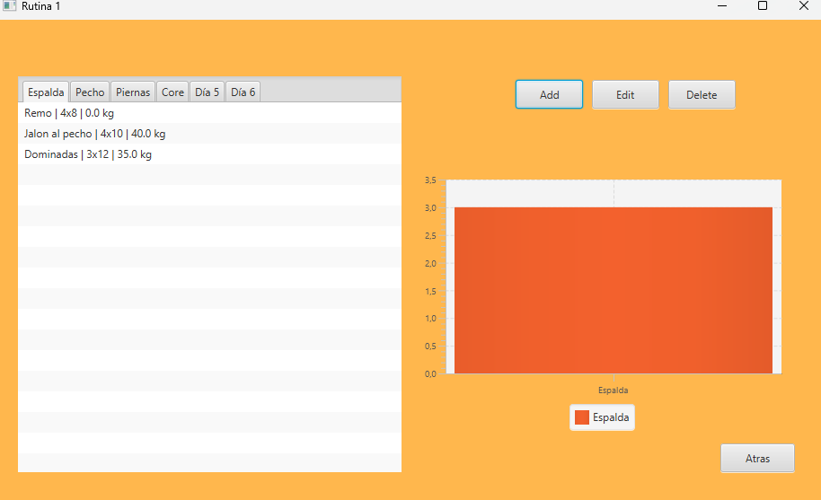

# Capturas de pantalla :camera:

A continuación algunas capturas de ejemplo.

*Figura 1 — Pantalla principal: vista de rutinas y acceso rápido al historial.*

*Figura 2 — Vista general de la rutina y la gráfica según el día.*

*Figura 3 — Selección de músculos para filtrar ejercicios.*

*Figura 4 — Selección y edición del ejercicio dentro de una rutina.*

"Consejo" :bulb:
    - Rellena los datos con los tuyos propios(pesos, repeteciones,...), esto son imagenes de referencia.

"Advertencia" :warning:
    No subas capturas que contengan datos sensibles o tokens de usuario. Si es necesario, difumina información personal antes de subir.

