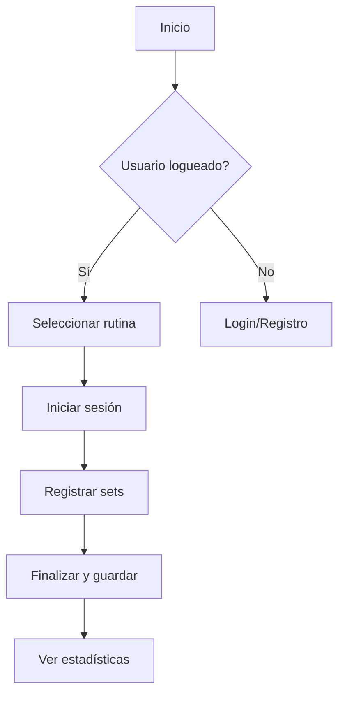
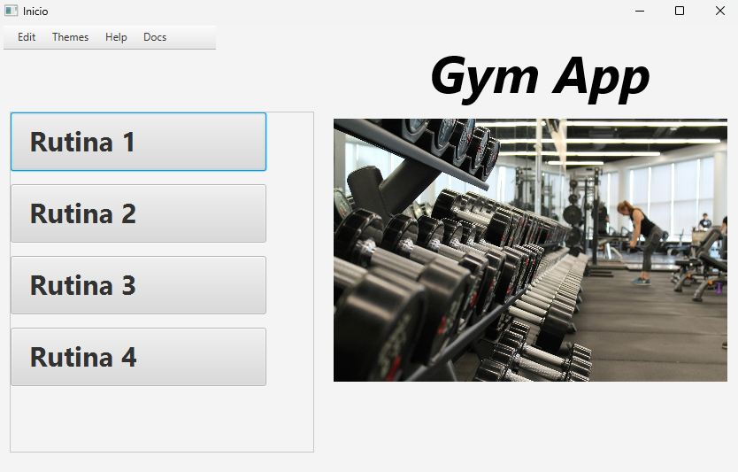

# Guía de uso :book: :muscle:

A continuación un tutorial paso a paso para comenzar a usar Gym App.

## 1 — Crear tu primera rutina
1. En la pantalla principal, pulsa **Edit** y luego **New**.
2. Selecciona el día.
3. Añade ejercicios, series y repeticiones.
4. Guarda la rutina.

"Atajo" :bulb:
Mantén pulsado un ejercicio para duplicarlo rápidamente.

## 2 — Registrar una sesión
- Abre la rutina y pulsa **Iniciar sesión**.
- Durante la sesión, ajusta pesos y repeticiones.
- Al finalizar, pulsa **Guardar**.

## Diagrama de flujo — Uso básico


## Imágenes comentadas

*Figura 1: Pantalla principal — aquí seleccionas rutinas y accedes al historial.*


*Figura 2: Registro de sesión — ajusta pesos y repeticiones en tiempo real.*

## Tooltips y anotaciones
- La palabra <abbr title="Repeticiones: número de repeticiones por serie">reps</abbr> muestra una ayuda al pasar el ratón.
- Los iconos de la interfaz muestran tooltips nativos para describir acciones.
- Usa anotaciones junto a bloques de código para explicar parámetros concretos.

## Bloques de código y anotaciones
Ejemplo de petición API para subir una sesión (ejemplo tipo curl). La línea con el token está destacada para alertar sobre su sensibilidad.

```bash hl_lines="2"
curl -X POST "https://api.gym-app.example.com/sessions" \
  -H "Authorization: Bearer <TOKEN>" \
  -H "Content-Type: application/json" \
  -d '{
    "user_id": 123,
    "routine_id": 45,
    "exercises": [
      {"exercise_id": 1, "weight": 80, "reps": 8},
      {"exercise_id": 2, "weight": 50, "reps": 10}
    ]
  }'
```

Anotaciones:
1. `Authorization` → Token de sesión (mantener privado).  
2. `user_id` → ID del usuario.  
3. `exercises` → Lista con sets (cada objeto describe ejercicio, peso y repeticiones).

"Seguridad del token" :warning:
    No publiques capturas o ejemplos que contengan tokens reales. Usa valores ficticios en la documentación.

## Consejos de uso
1. Sincroniza con tu cuenta al terminar la sesión para evitar pérdida de datos.  
2. Crea plantillas para entrenamientos recurrentes y ahorra tiempo.  
3. Revisa las gráficas semanalmente para ajustar cargas y progresión.

[^nota-progreso]: Recomendado: registra al menos 3 semanas de datos para observar tendencias reales.

---
*Si quieres, puedo añadir anotaciones automáticas con `content.code.annotate` para el bloque curl (si usas la feature del theme) o marcar otras líneas con `hl_lines`. ¿Quieres que lo deje ya así en tu repo y haga un commit?*